# Spiral's Echo — Map & Environment Asset Gallery

ภาพทั้งหมดเป็น concept reference สำหรับสร้าง production tiles/props ใหม่ โปรดอ่าน [MOCKUP_MANIFEST.md](MOCKUP_MANIFEST.md) ก่อนนำไปใช้

## Region 1 — Verdant

Panel order: Aethergate Town, Whisperwood, Gelwater Fen, Rootbound Grotto, Ruined Archive, Stormgrass Plateau, Echo Citadel

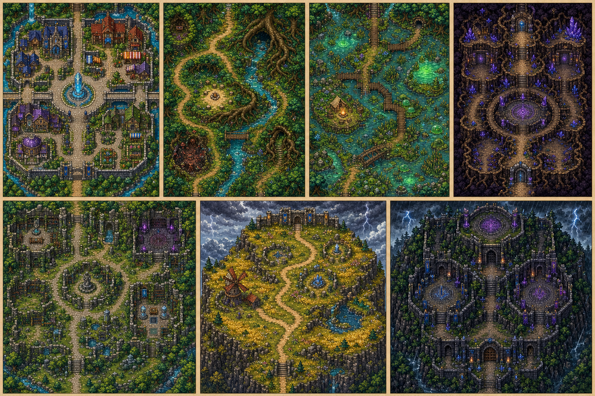

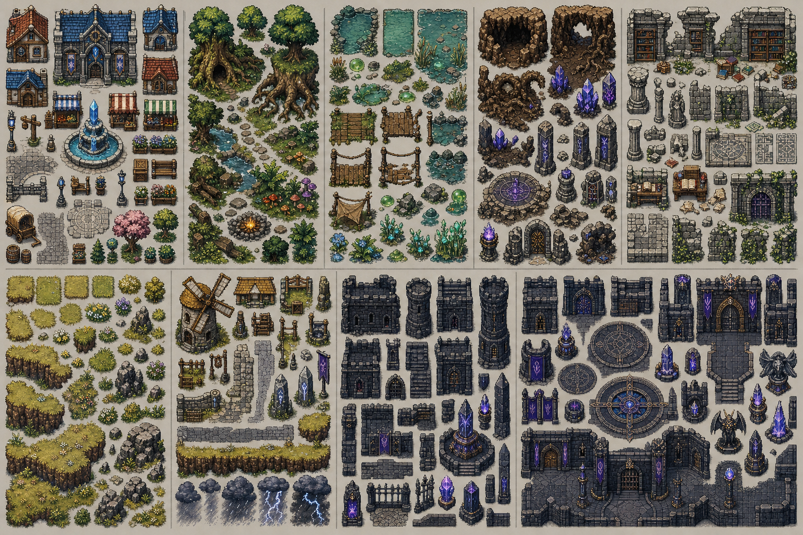

[Aethergate Town detailed gallery](region-01-everbloom/aethergate-town/AETHERGATE_GALLERY.md)

## Region 2 — Sunveil Coast

Panel order: Copperwind Outpost, Saffron Dunes, Mirrormere Oasis, Mangrove Reach, Buried Sun Temple

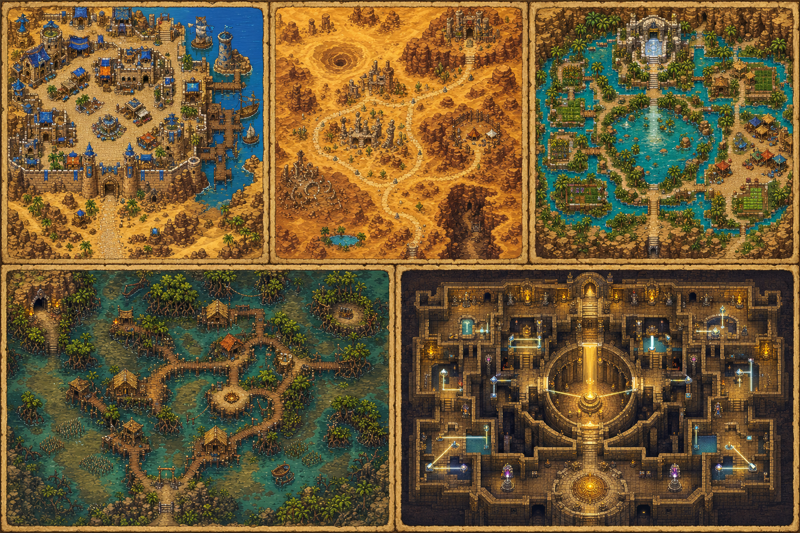

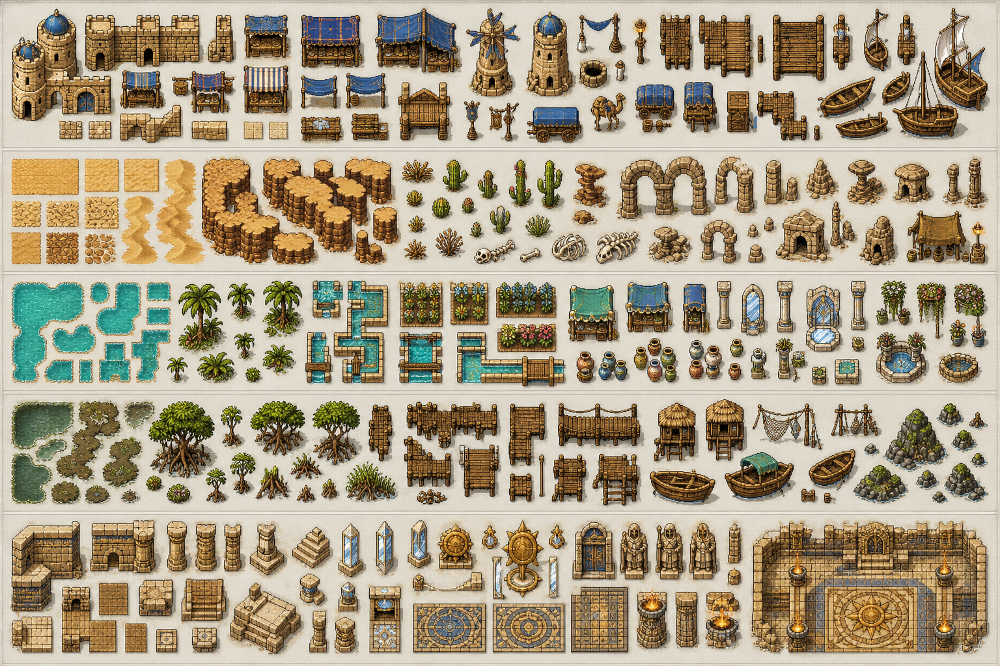

## Region 3 — Emberfrost Highlands

Panel order: Emberhaven, Ashen Steppe, Basalt Foundry, Glacier Pass, Crown of Winter

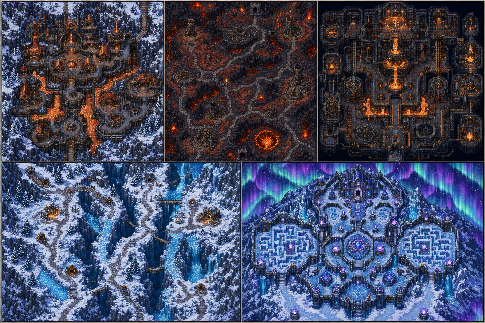

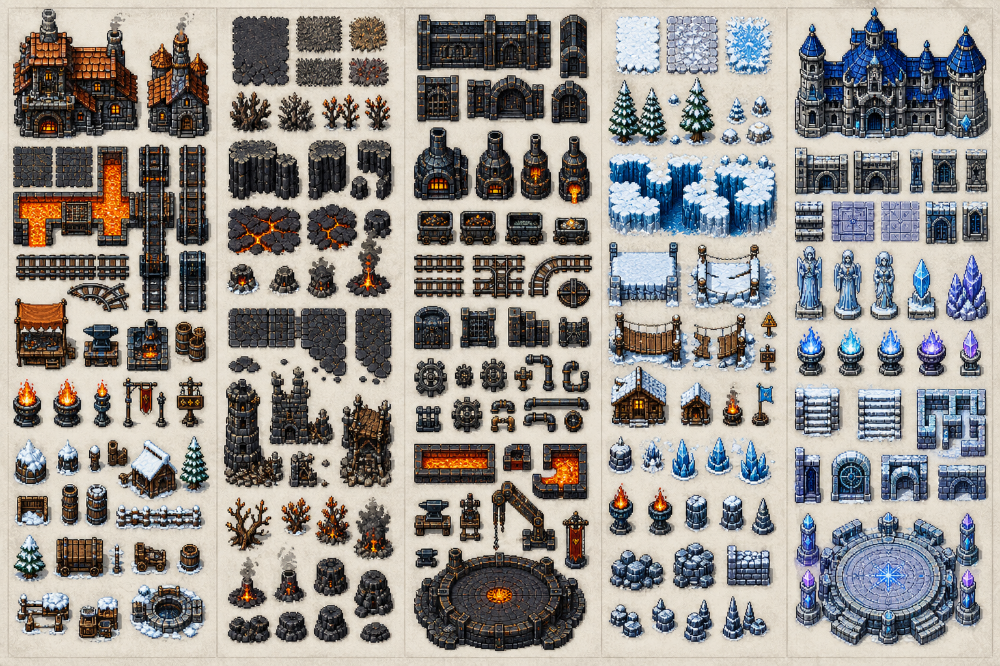

## Region 4 — Mycelial Gloam

Panel order: Sporewood, Miresong Marsh, Lumencap Caverns, Haunted Archive, Mycelium Sanctum

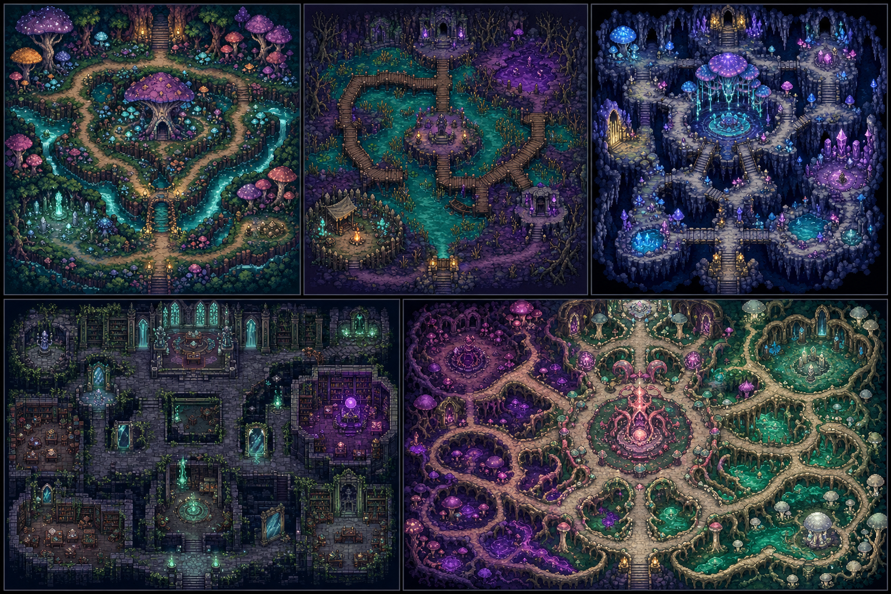

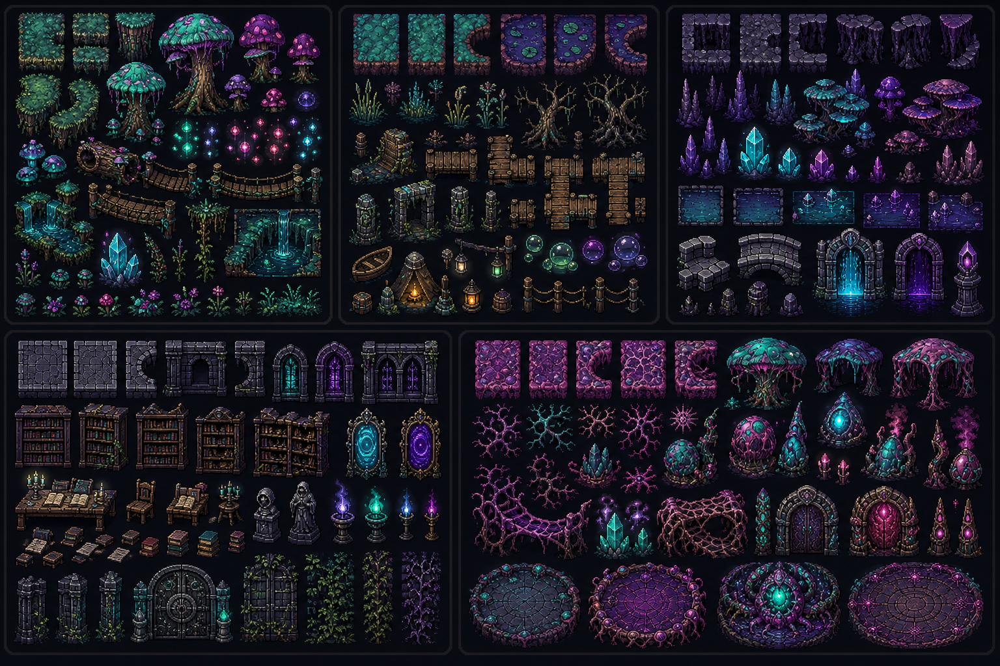

## Region 5 — Skyclock Meridian

Panel order: Skyhold, Zephyr Meadows, Broken Observatory, Brassward, Tempest Engine

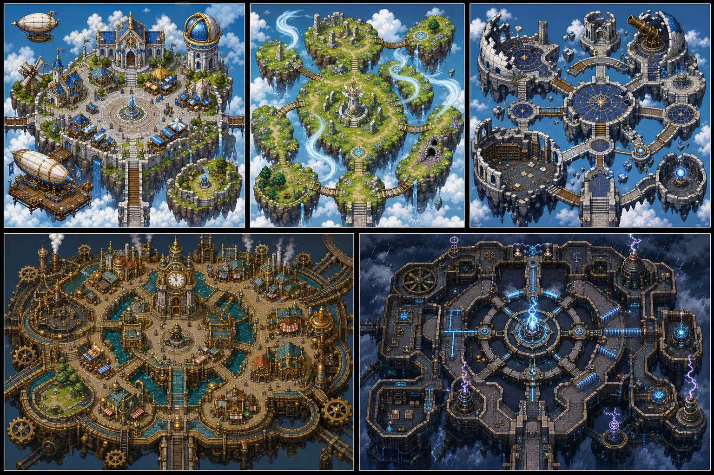

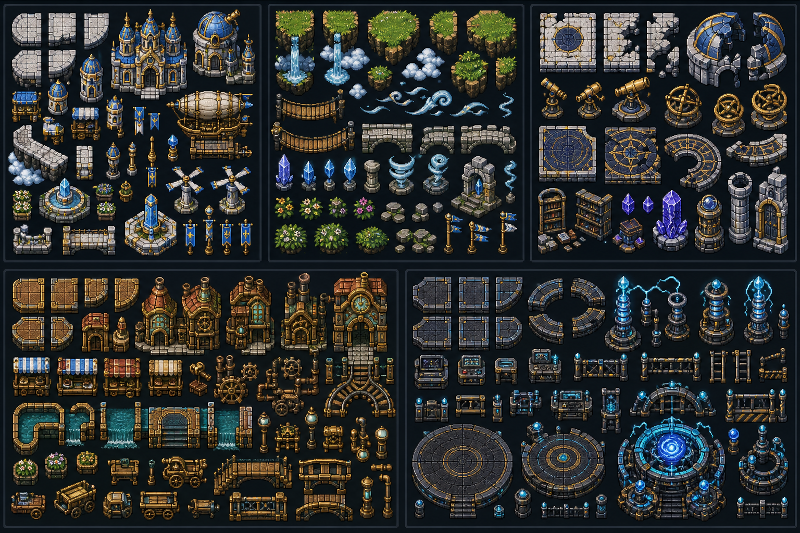

## Region 6 — Astral Rift

Panel order: Last Observatory, Starfall Expanse, Memory Constellation, Celestial Approach, Nexus

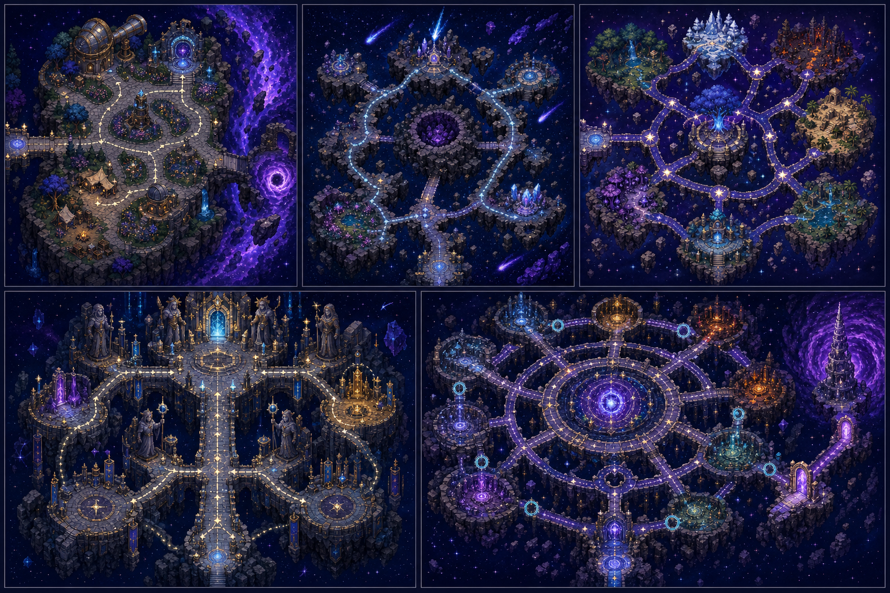

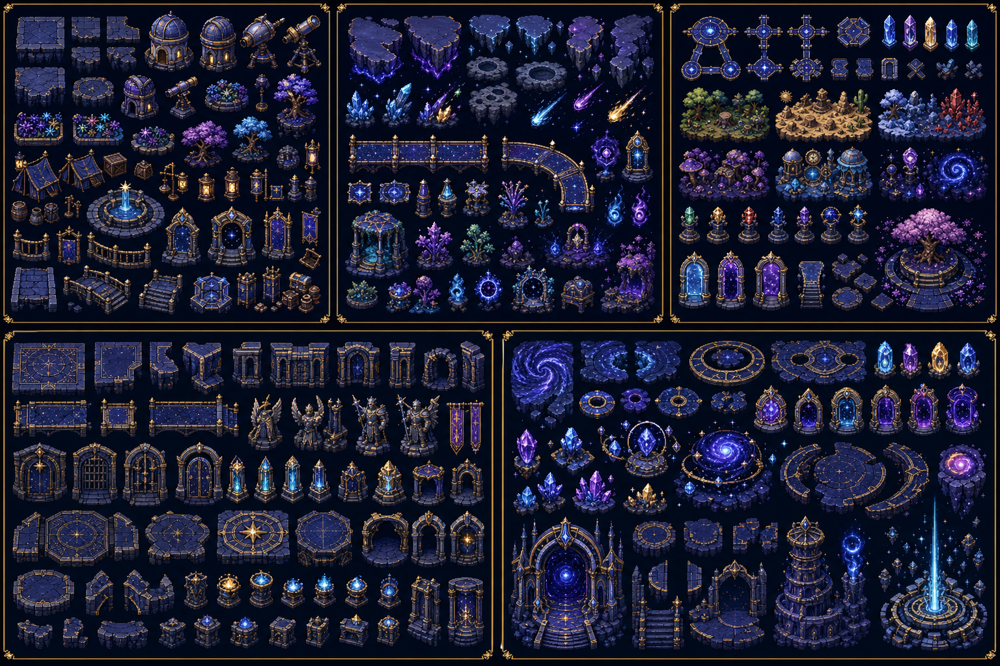

## Endless Tower of Echoes

Panel order: Arrival Crossroads, Combat Loop, Route Choice Gauntlet, Knowledge Puzzle Chamber, Treasure and Curse Vault, Sanctuary Checkpoint, Boss Floor, Ascension Floor

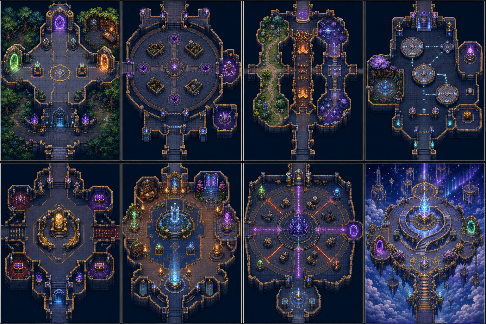

Asset groups: Tower shell/sockets, objectives/hazards, route/rewards, sanctuary/learning, six-region overlays, boss/ascension

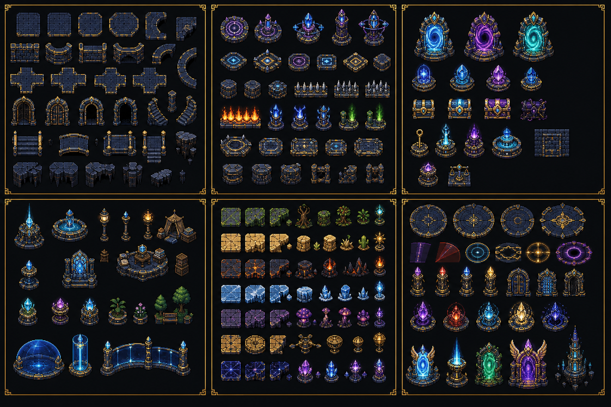
