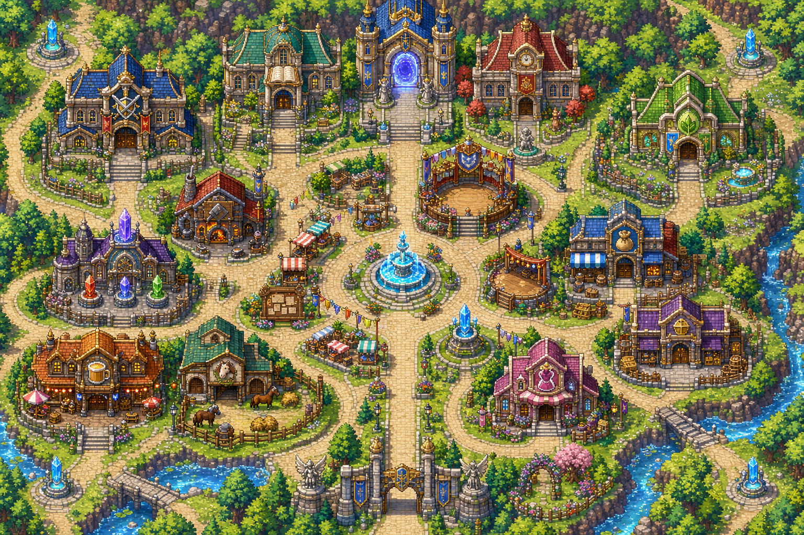
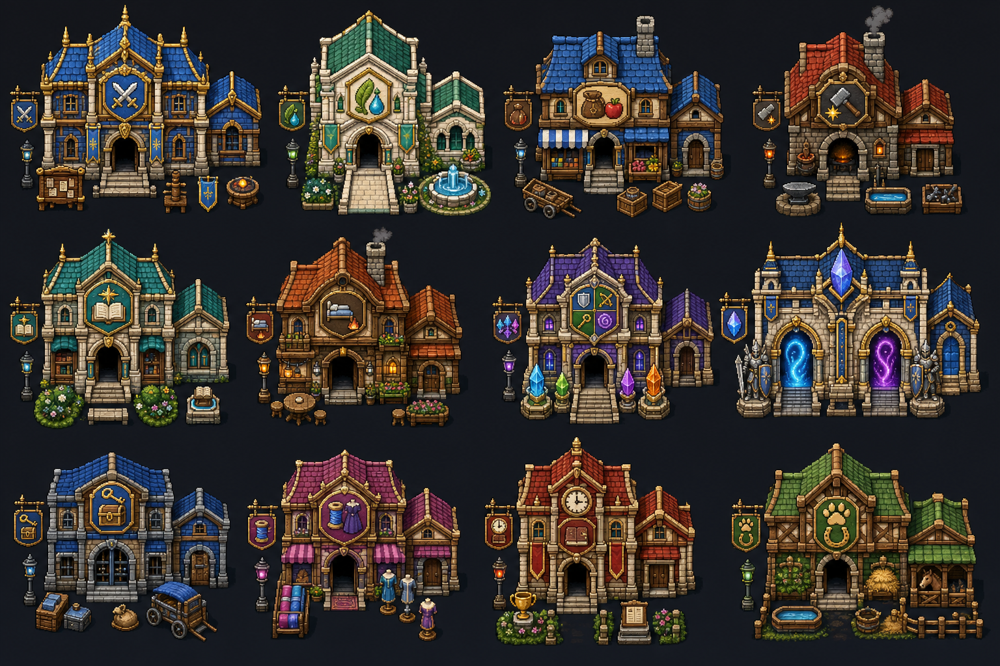
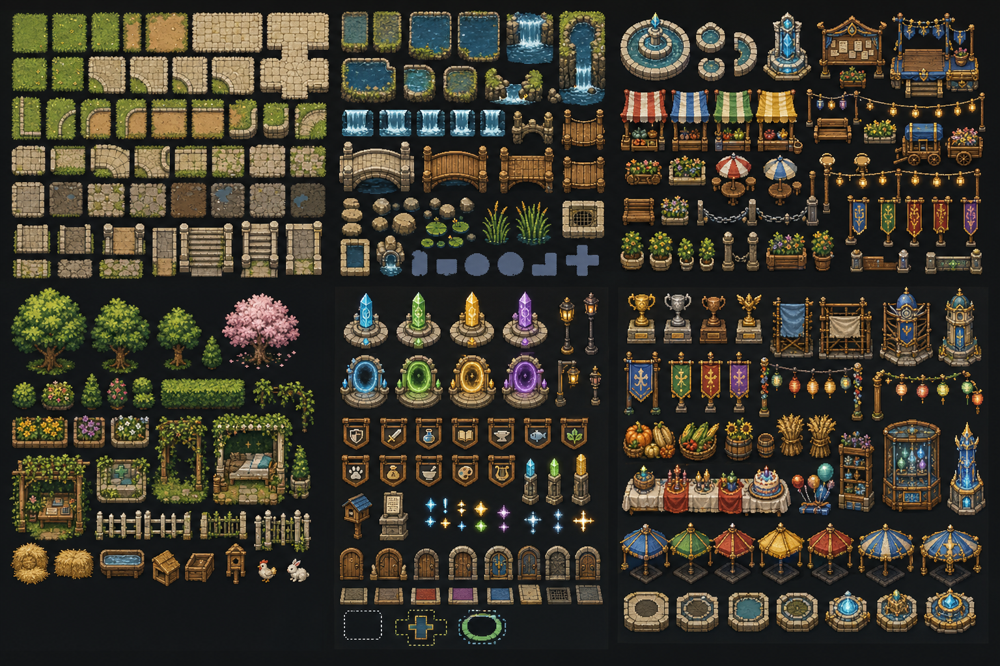
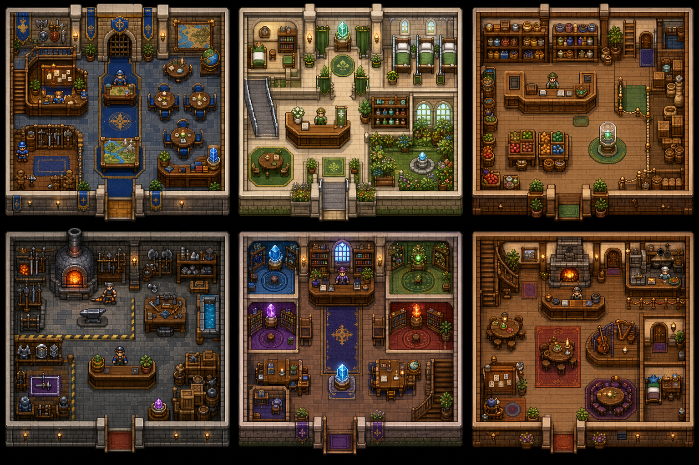
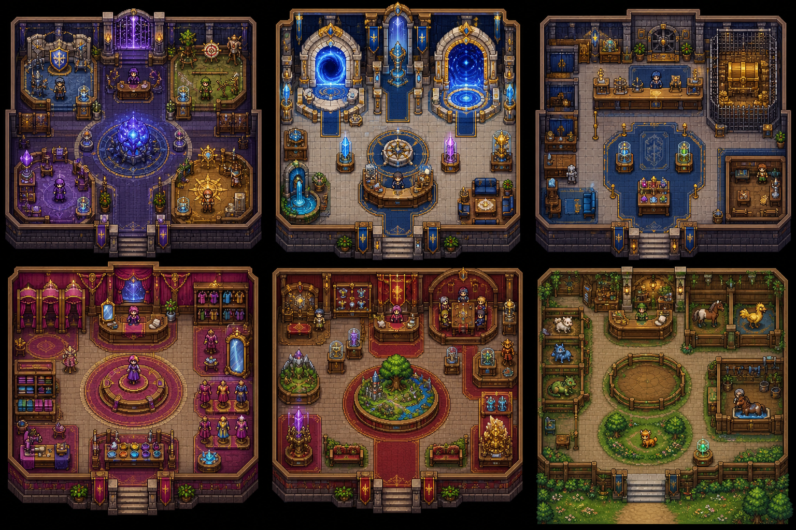
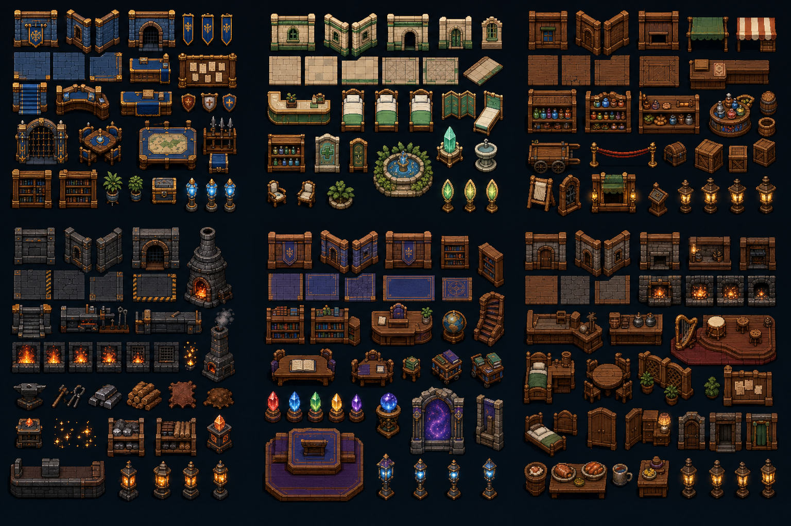
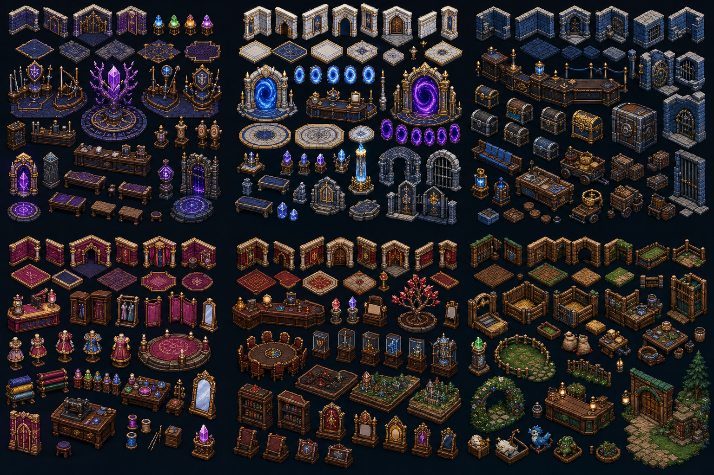

# Aethergate Town — Detailed Mockup Gallery

คู่มือการสร้างจริง: [AETHERGATE_TOWN_BUILD_SPEC.md](AETHERGATE_TOWN_BUILD_SPEC.md)

ภาพเหล่านี้เป็น concept references สำหรับสร้าง modular 16px production assets ใหม่ ไม่ใช่ runtime spritesheets

## Town Map

## Twelve Building Exteriors

ลำดับ 4 x 3: Guild, Hospital, General Shop, Forge, Academy, Inn, Job Hall, Tower Gatehouse, Bank, Tailor, Town Hall, Companion Lodge

## Outdoor Environment Assets

กลุ่ม 3 x 2: ground/paths, water/bridges, plaza/social, gardens/nature, navigation/interaction, progress/festival/return hooks

## Core Interiors

ลำดับ 3 x 2: Guild, Hospital, General Shop, Forge, Academy, Inn

## Progression, Civic and Social Interiors

ลำดับ 3 x 2: Job Hall, Tower Gatehouse, Bank, Tailor, Town Hall/Chronicle, Companion Lodge

## Core Interior Assets

กลุ่ม 3 x 2: Guild, Hospital, General Shop, Forge, Academy, Inn

## Progression Interior Assets

กลุ่ม 3 x 2: Job Hall, Tower Gatehouse, Bank, Tailor, Town Hall/Chronicle, Companion Lodge

